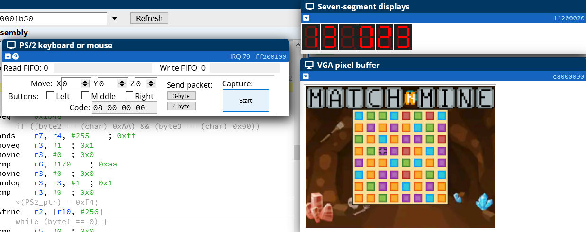

# chess
A chess engine utilizing SFML for its GUI and a NegaMax AI algorithm.

## Dependencies
- Require SFML system, window and graphic libraries to run.

## Features
-Can play locally with another player or with an AI.
-En Passe, castling, promotion, stalemates, checks and checkmates are handled by engine.
-Displays valid moves on GUI, allowing newer players identify moves they can perform.
-Utilizes a modified NegaMax AI algorithm to identify the best move. Evaluation function uses a heuristic based on position and values of piece if it captures one. The tables and values are from: https://www.chessprogramming.org/Simplified_Evaluation_Function

## Challenges
- At first, the engine was designed to evaluate moves lazily. This meant when the user chooses a move, the engine will verify if that move is valid after it is selected. This ultimately led to complications in features such as checkmate and the AI. For checkmate this system did not work as there are no moves to choose, thus checkmate is never achieved. For the AI, lazy evaluation could work but would result in inefficiencies. This made me redesign the engine to calculate all the moves for each turn, and then the evaluation would just be the player choosing out of these legal moves.

## Future considerations
- When I first started this project, I did not investigate the state of the art of chess engines and how they are designed, and this bottlenecked my AI in terms of performance. While there are possible improvements to performance of the AI, the engine is not properly fitted to allow efficient generation and search of moves for depths of greater than 3 in a reasonable amount of time. I would recommend reading upon engine design. In the future I will redesign the engine to utilize bitboards to hold the states of the board, which allow quick evaluation of the position utilizing bitwise arithmetic and continue development on the AI.  
